# 2.1 KidsBlock Desktop Graphical Programming

KidsBlock Desktop is a graphical programming tool designed to help children and beginners learn programming. It uses a visual programming interface to build programs by dragging code blocks rather than writing codes directly. This is especially suitable for users without programming background, as it simplifies the process and lowers the learning threshold.

**Main Features:**

1. **Graphical interface**: Users create programs by dragging code blocks with different functions (such as loops, conditional judgments, variables, etc.), rather than learning complex code syntax issues. 
2. **Educational orientation**: It is designed for children and teens with a user-friendly interface, and it helps them learn programming thinking and logic in fun.
3. **Interactive learning**: Through graphical programming, children see how the programs they write process and respond in real time, increasing the joy and interactivity.
4. **Diversified functional blocks**: It provides a wealth of blocks for the creation of different types of programs and projects, including simple animations, games and gadgets.
5. **Easy to expand**: Some versions of KidsBlock are able to extend the functionality through custom modules or plug-ins, thus providing more programming possibilities.

With graphical programming, KidsBlock Desktop aims to stimulate children's interest in programming and develop their problem-solving and logical thinking skills.

# 2.2 Install Kidsblock on Windows

1.Download Kidsblock package: [http://xiazai.keyesrobot.cn/KidsBlock.exe](http://xiazai.keyesrobot.cn/KidsBlock.exe)

2.Click “KidsBlock Desktop.exe”.

3.Tick “**Anyone who uses this computer(all users)**” and click “**Next**”.

4.Click “**Browse...**” to choose a path for the software (here we choose Disk C) and then “**Install**”.

5.Click “Finish” and open Kidsblock.

6.If a warning interface pops up, just “**Allow access**”. 

​	Main interface of Kidsblock:

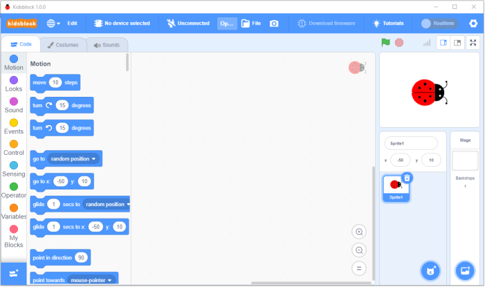

# 2.3 Install Kidsblock on MacOS

1.Download Kidsblock package: [https://xiazai.keyesrobot.cn/KidsBlock.dmg](https://xiazai.keyesrobot.cn/KidsBlock.dmg)

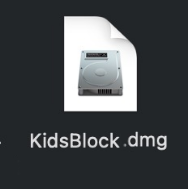

2.After downloading, Click KidsBlock. Drag the icon of KidsBlock Desktop into Applications.

3.After installation, you can see the icon of KidsBlock.

# 2.4 Getting started with Kidsblock

(**Here we demonstrate on Windows, and it can be a reference for MacOS.**)

## 2.4.1 Main Interface Functions 1

## 2.4.2 Languages

Click  to choose “English” or “简体中文”: 

## 2.4.3 Driver

**NOTE: If the driver has already installed on your computer, please skip the following steps.**

Click  to choose “**Install driver**”.

A. Welcome to the Device Driver Installation Wizard and click “**Next**”.

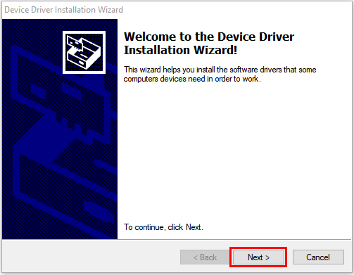

B. “**Finish**”.

C. “**Next**”

D. “**Finish**”

E. If a warning interface pops up, just “**Allow**”. And then click “**Install**”.

F.“**Install**”

G. “**Finish**”

H. “**Extract**”

I. “**Next**”

J. Tick “**I accept this agreement**” and then “**Next**”.

K. “**Finish**”

L. “**INSTALL**”

M. Wait for the completion of driver installing. And click “**OK**”.

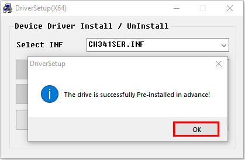

## 2.4.4 Development Board

Click  to choose a control board. We have integrated the board we need in this software: click “Kit” and find “ESP32 coding box” to “**Connect**”. After connecting, “**Go to Editor**”. 

 changes into , and  changes into . These means ESP32 board and COM port are both connected.

## 2.4.5 Serial Port

If the ESP32 board is connected but  does not change into , we need to set a COM port manually. 

Click  and “**Connect**”. When you see "connected", the port is set.

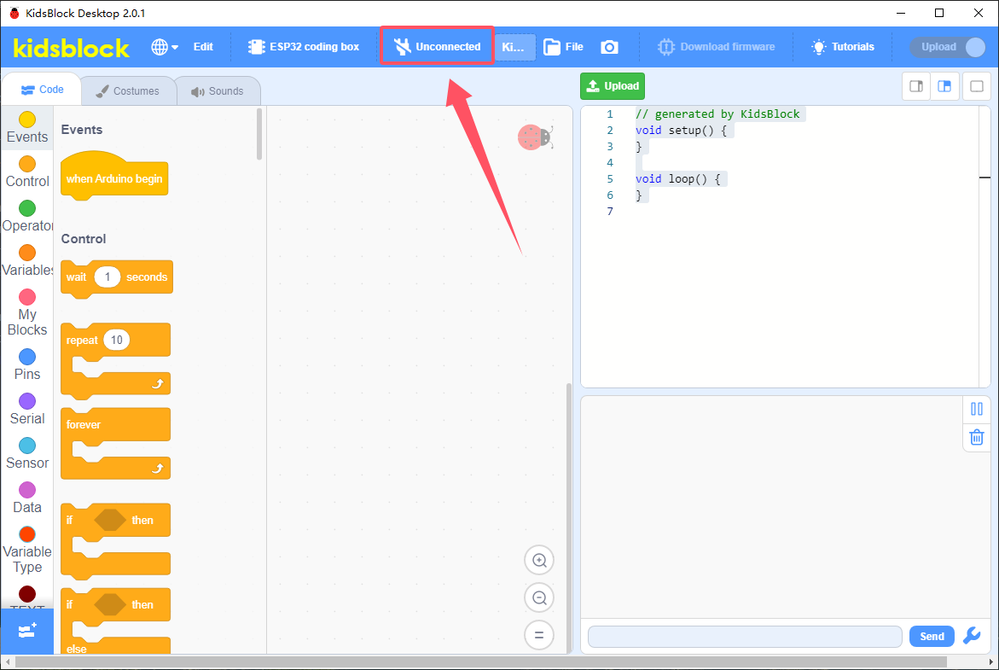

Disconnection: click  and “**Disconnect**”.

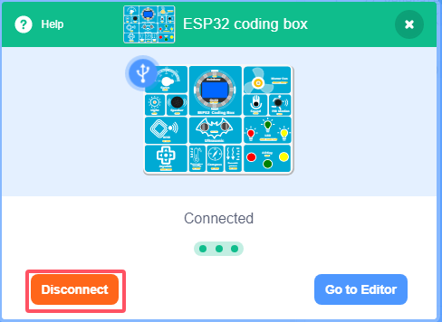

## 2.4.6 Main Interface Functions 

## 2.4.7 Extensions

**NOTE: All required modules are integrated in main board, so this section is for reference.**

Extensions: 

Click  to search and load sensors/modules. For instance, click “passive buzzer”  and “**Not loaded**” changes into “**Loaded**”. Passive buzzer is added.

   

Click  to back to editor, and you will see the Passive buzzer block.

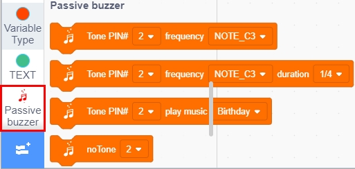

If you want to remove it, enter  and click  again, and “Loaded” changes into “Not loaded”. That means this block is removed. 

    

## 2.4.8 How to open code

**Method 1:**

Click the SB3 file you want to load. If you want to open , click it to directly load to the software. After that, connect to the board and port.

**Method 2:**

Open Kidsblock and click “**file**” to choose “**Load from your computer**”, open a file of .SB3, for example, .

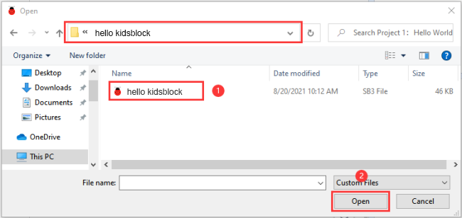

## 2.4.9 Upload Code and Set Baud Rate

### 2.4.9.1  Upload Code

Load  into Kidsblock, and set the development board and port. Click .

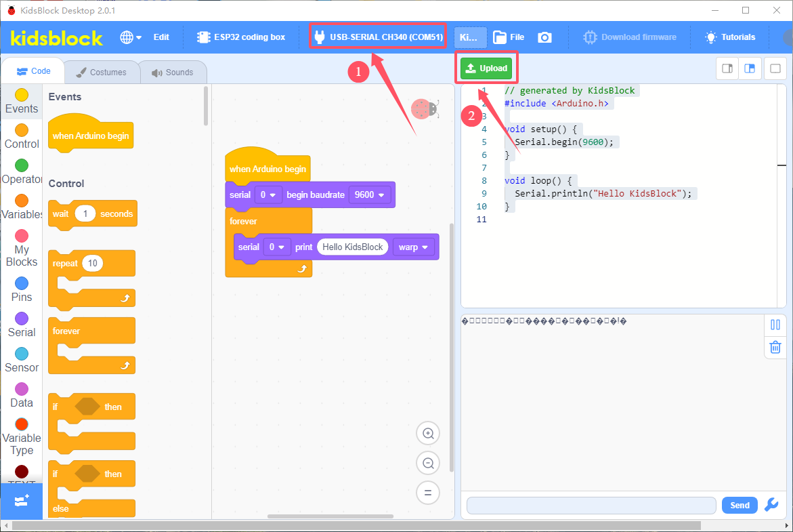

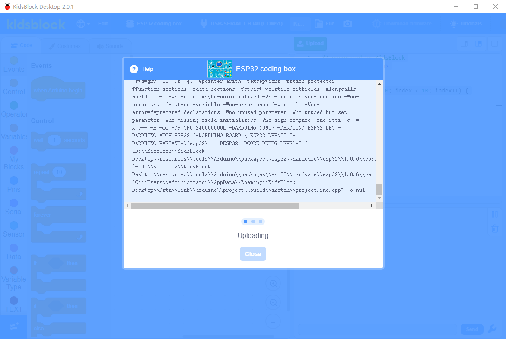

After uploading, the printing box of Kidsblock prints “Hello KidsBlock”.

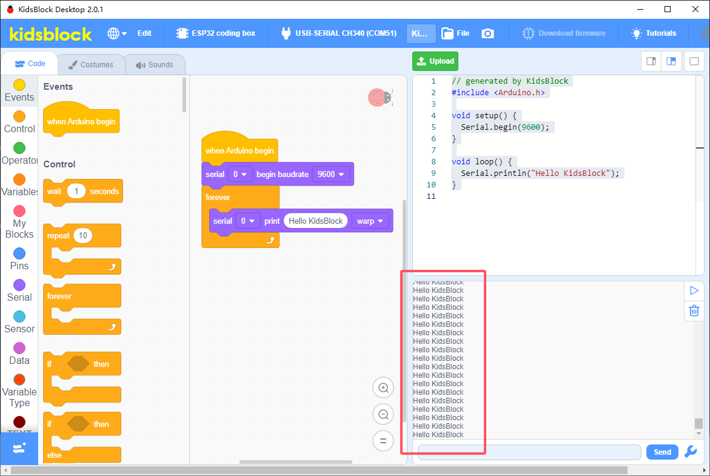

### 2.4.9.2 Set Baud Rate

Set printing box: 

: small

: large

: none

If there is no output or it outputs garbled words, please click  to set baud rate first. The baud rate should be consistent with the code. Here it is 9600.

