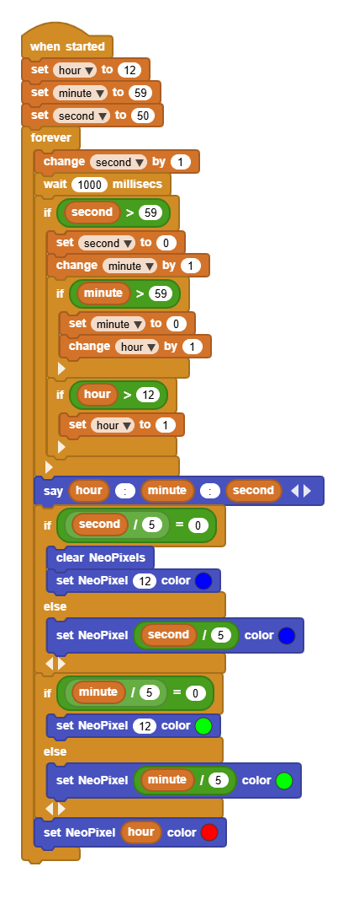

# 3.30 RGB Ring Clock

## 3.30.1 Overview

In this project, we build an informal clock with an RGB ring, whose three colors represent hour, minute and second respectively. Since the ring only boasts 12 beads, each bead is 5 seconds/minutes (60/12=5).

## 3.30.2 Code Flow

As shown in the flowchart, we use red for hour, green for minutes, blue for seconds. When second = 60, minute adds 1, and when minute = 60, hour adds 1. 

Note that here we adopt 60/5=12 rather than 59/5=11.8, this is because the variable type is integer and the value should be divided by 5. And 60 can be perfectly divided into 12 parts.

## 3.30.3 Test Code

You can manually build blocks, or directly open the code file we provide: `3-30-RGB Ring Clock.ubp`. If you have any questions about how to open code files or upload code, please back to `1.9 Upload Code`.

**Build code blocks:**

1. In , drag  and  to the script area, and stack them together.

**Time:**

2. Create 3 variables named `hour`, `minute`, `second`, and set an initial time.
3. Based on `second`, increase by 1 at a time till it reaches 59, and then zero out the `second`.
4. When `second` reaches 59, `minute` increases by 1. Similarly, zero `minute` out till it reaches 59.
5. When `minute` reaches 59, `hour` increases by 1. There are subtle differences: we reset `hour` to 1 till it reaches 12.

**RGB:**

6. There are only 12 LED beads, yet 60 is the maximum in minutes and seconds. Thus, we divide 60 by 12 to get 5: each LED stands for 5 seconds or 5 minutes. We use red(hour), green(minute), and blue(second) to indicate for three clock hands. For instance, when time is 12:59:50, the 12th LED shows in red, the 11th one is green, and the 10th one is blue.

**Complete code:**

## 3.30.4 Test Result

Before uploading code, you need to input an initial time in the following blocks of variables hour, minute, second. Herein, we set to 12:59:50.

Connect the coding box to the MicroBlocks via USB or Bluetooth, and click  to upload the code to the coding box. You will see the RGB ring shows the time: red for hour, green for minute, blue for second. A minute passes as blue runs a circle. Only one color will be displayed when they are overlapped. Blue will not cover green while green will not cover red. 

Note that this is an informal clock without a clock chip. So its errors begin to accumulate over time.

