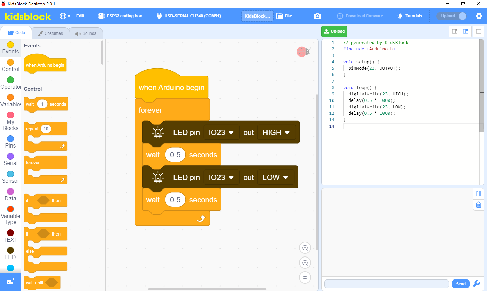
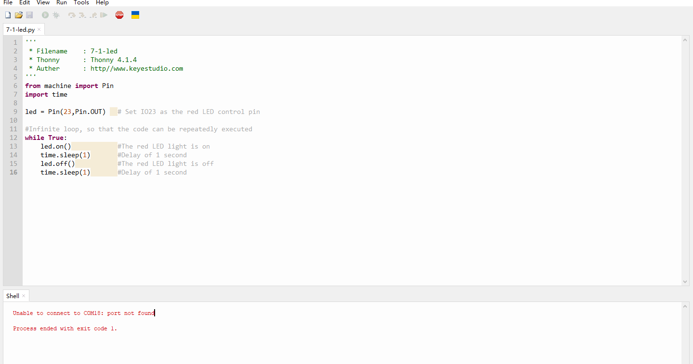

**首先感谢选择keyestudio产品,**

**我们将继续为你提供好的产品和服务!**

------

**关于keyestudio**

Keyestudio是KEYES Corporation旗下最畅销的品牌，我们的产品包括Arduino开发板，扩展板，传感器模块，树莓派，micro：bit扩展板和智能小车，以及为各种级别的客户设计的完整入门套件，这些入门套件旨在为任何水平的客户学习Arduino知识。

我们所有的产品均符合国际质量标准，并在世界各地的不同市场中得到了极大的赞赏。 

欢迎从我们的官方网站查看更多内容：

[http://www.keyestudio.com](http://www.keyestudio.com)

------

**获取资料和售后服务**

1. 如果发现某些东西丢失或损坏，或者学习套件时遇到一些困难。keyestudio会提供免费和快速的支持，如果您有任何疑问，请给我们发送电子邮件：[service@keyestudio.com](http://m.138.gz.cn/webadmin/~CAmsnCrrNXhTAySKCerrIfWjjZuuWVfI/~/usr/mod_edituser.jsp?;uid=service@keyestudio.com;;clearCache=)

2. 欢迎提出建议和反馈，我们会根据您的反馈不断更新套件和教程，以使其更好。谢谢！

------

**产品安全**

1. 本产品内含排针针脚，注意刺伤，请勿让7岁以下的儿童接触，放在他们拿不到的地方。
2. 本产品包含导电部件(控制板和电子模块），请按照本教程的要求进行操作，不当的操作可能导致过热并且损害零件，请勿触摸并立即断开电路电源。

------

**版权**

keyestudio商标和徽标是KEYES DIY ROBOT co.,LTD的版权,任何人和公司在没有授权的情况下，不得复制，售卖，转卖，keyestudio品牌的产品。如果你有兴趣在当地售卖我们的产品，请联系我们专业的批发销售人员：[fennie@keyestudio.com](http://m.138.gz.cn/webadmin/~CAmsnCrrNXhTAySKCerrIfWjjZuuWVfI/~/usr/mod_edituser.jsp?;uid=fennie@keyestudio.com;;clearCache=)

------

# ESP32 Coding Box

## 1. Introduction

Based on ESP32, this coding box is a learning toolbox for children over 6 years old, as a shell wraps its circuit board, avoiding pins scratched children. 

The ESP32 coding box integrates 16 sensors and modules, including LED, button, 1.3 inch OLED display, photoresistor, sound sensor, speaker, temperature and humidity sensor as well as pressure sensor. Thus, the box can be matched with interesting experiments. In this tutorial, we provide 36 projects, like small lamp, automatic window, sound control light, compass, and environmental monitoring.

Each project contains two programming methods: MicroPython and KidsBlock Desktop graphical programming. The latter only need to build up code blocks so is conducive to the initial training of programming thinking.

## 2. Features

**1. No wiring:** We integrate wiring in circuit board, so no worry about the wrong wiring to burn the module.

**2. Multiple functions:** With ESP32 development board as control board, this box contains 16 sensors and modules, and it is available to either external 7-12V DC power or 6 AA batteries.

**3. Simple structure:** Ready-to-use and full shell package prevents hands from being scratched by pins and protects the board as well.

**4. Strong expansibility:** Four RJ11 interfaces are reserved beyond the shell, all of which are compatible with IIC communication.

**5. Basic programming learning:** Graphical programming for new hands to cultivate programming logic and foundation; MicroPython programming for developers to contact the underlying codes combined with hardware.

## 3. Parameters

**Operating voltage:** 3.3v

**External DC power:** 7-12V

**Built-in battery holder:** 9V (six AA batteries, of 1.5V each)

**USB power:** 5V

**Operating current:** 

**Operating temperature:** –10 °C ~ +65 °C

## 4. Kit List

| #    | PIC  | NAME             | QTY  |
| ---- | ---- | ---------------- | ---- |
| 1    |      | ESP32 coding box | 1    |
| 2    |      | Type-c cable     | 1    |
| 3    |      | Key              | 1    |
| 4    |      | IC card          | 1    |

------

## 5. 教程链接

### 1.KidsBlock Desktop软件图形化编程教程

[点击跳转到图形化编程教程](./KidsBlock Desktop/KidsBlock Desktop Tutorial.md)

### 2.Thonny软件MicroPython编程教程

[点击跳转到MicroPython编程教程](./MicroPython/MicroPython Tutorial.md)

